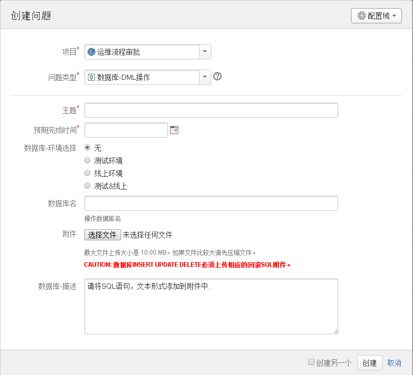
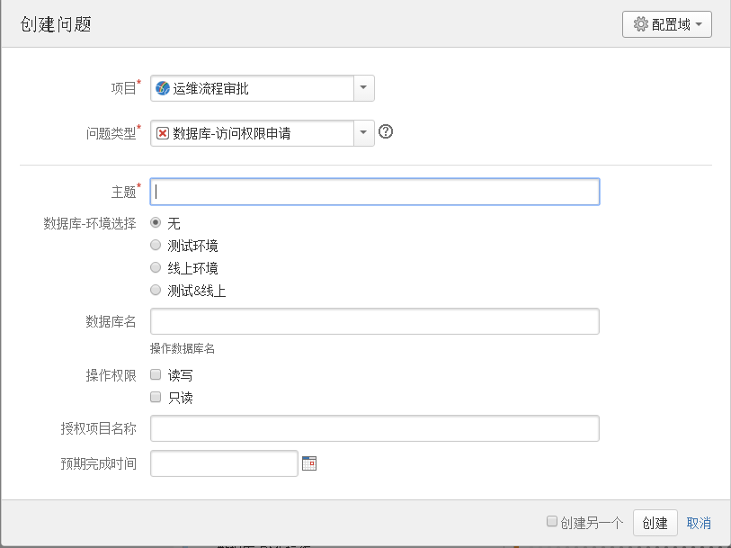
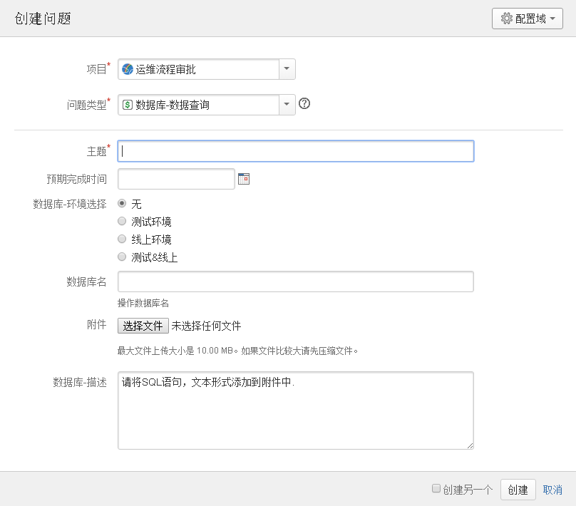
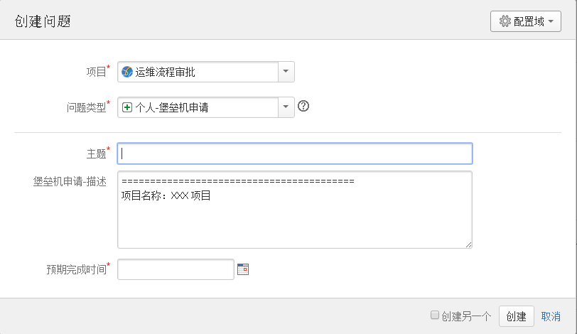
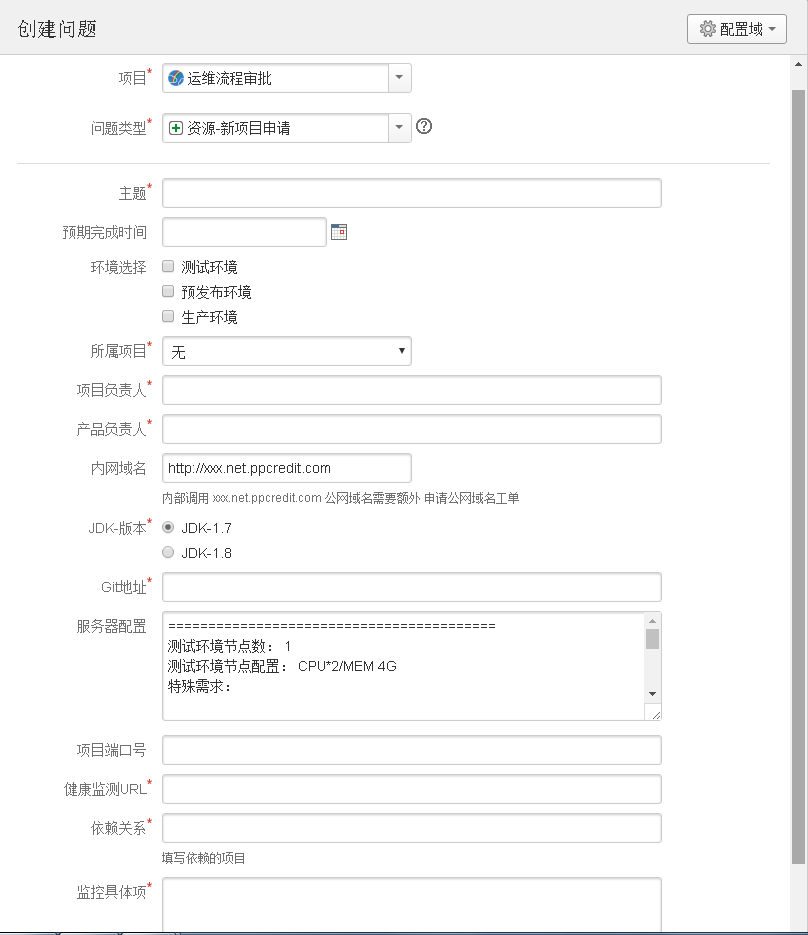
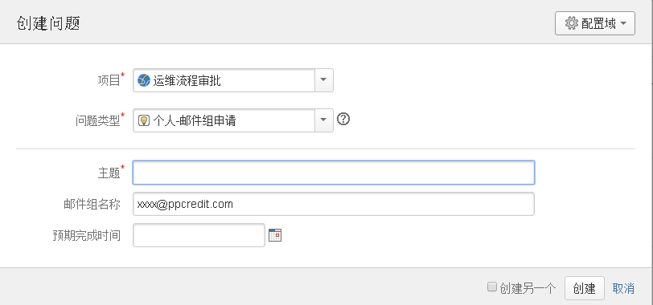
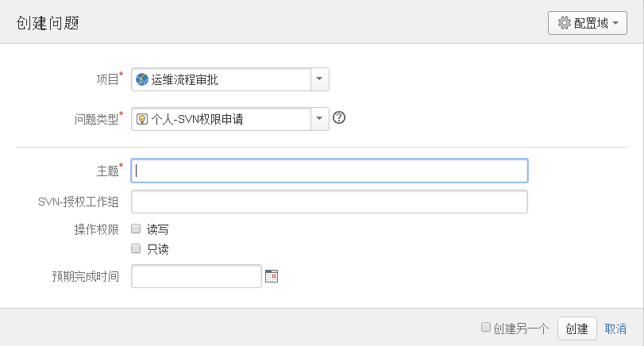
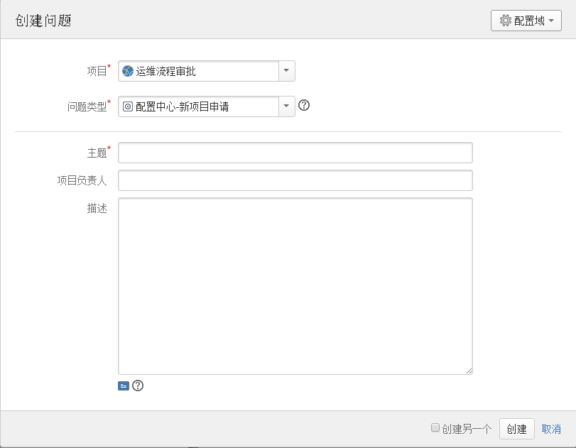
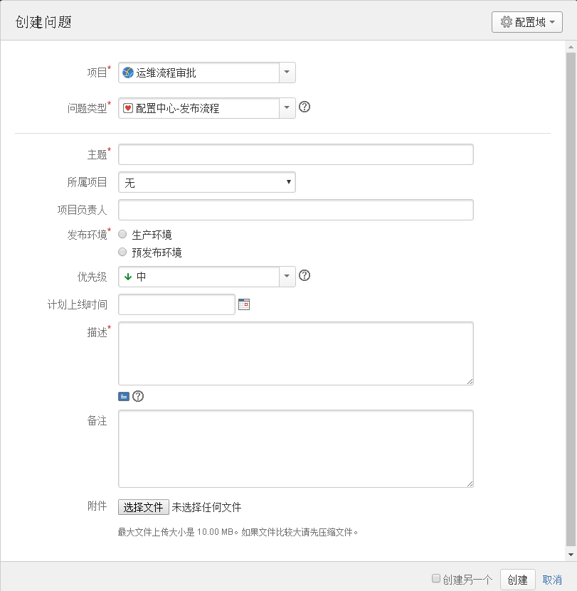

# 流程规范 #
- [数据库-DML操作](#1)
- [数据库-访问权限申请](#2)
- [数据库-数据查询](#3)
- [个人-堡垒机申请](#4)
- [资源-新项目申请](#5)
- [个人-邮件组申请](#6)
- [个人-SVN权限申请](#7)
- [配置中心-新项目申请](#8)
- [配置中心-发布流程](#9)
- [配置中心-接入配置中心的第一步](http://192.168.214.212:8090/x/ngIL)
- [配置中心-上线流程](http://192.168.214.212:8090/x/qAIL)

  

- 数据库-DML操作

  

- 数据库-访问权限申请

  

- 数据库-数据查询

  

- 个人-堡垒机申请

  

- 资源-新项目申请

  

- 个人-邮件组申请

  

- 个人-SVN权限申请

  

- 配置中心-新项目申请

  

- 配置中心-发布流程

